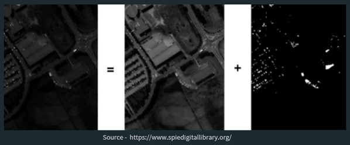
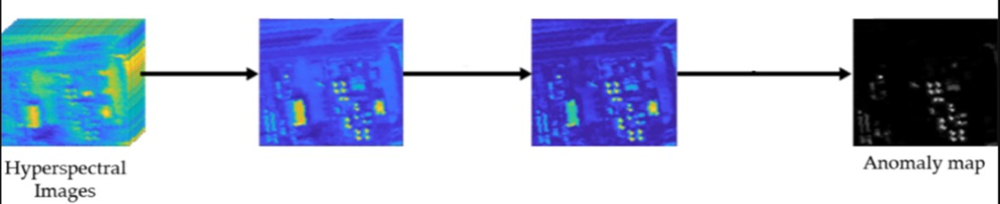

# Discriminative Semi-Supervised GAN for Hyperspectral Anomaly Detection

This repository contains a study on Discriminative Semi-Supervised Generative Adversarial Network (DSS-GAN) used in a study on Hyperspectral Anomaly Detection. The model is designed to leverage both labeled and unlabeled data for improved performance in Hyperspectral Image Analysis.

## Contents
- What is Hyperspectral Anomaly Detection?
- Abstract
- Introduction
- Methodology
  - I. Coarse RX Detection
  - II. (a) Discriminative Semi-Supervised GAN
  - II. (b) Loss Function Evaluation
  - III. Redefined RX Detection
- Experimentation
- Conclusions

The repository also contains the Power Point Presentation with detailed explanation of the research.